---

  

---

### 🚀 Tech Stack

---

### 🔥 Featured Projects

| Project | Stack | What it does |
|---|---|---|
| 🌾 **[MittiMitra](https://github.com/arnavps)** | Next.js · FastAPI · Groq LPU · Polygon | Edge-to-Ledger platform eliminating ₹92K Cr post-harvest loss for Indian farmers |
| 🚇 **[CrowdSense AI](https://github.com/arnavps)** | Random Forest · LangGraph · FastAPI | Predictive crowd intelligence for Mumbai transit — beat the surge before it happens |
| ♻️ **[VerdaFlow](https://github.com/arnavps)** | ML · Time-Series · Cloud · Serverless | Smart waste collection that learns spatiotemporal patterns to slash city costs |
| 💳 **[CredNexis AI](https://github.com/arnavps)** | LightGBM · XGBoost · NetworkX · Socket.io | Real-time credit scoring for 51M unbanked MSMEs — 88% accuracy in milliseconds |
| 📜 **[ACRIS](https://github.com/arnavps)** | LangChain · ChromaDB · NetworkX · Multi-Agent | 6-agent system monitoring RBI + SEBI 24/7; detects cross-regulation contradictions |

---

### 📊 GitHub Stats

|  |  |
|---|---|

---

### 🔐 Cybersecurity Arsenal

---

---

### 🌐 Connect

---

*"Curious, Adaptable, and Driven — I thrive where I can experiment, innovate, and build."*

